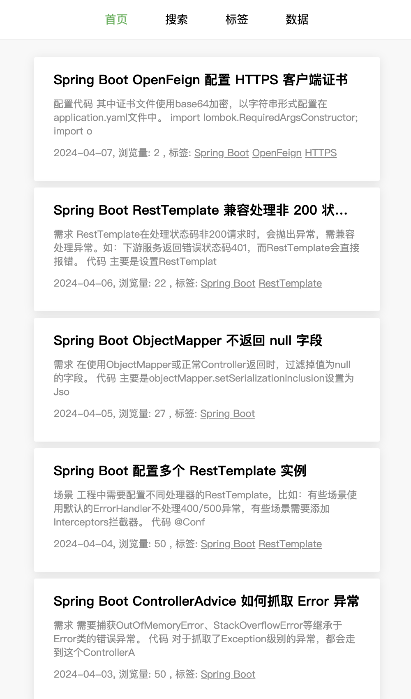
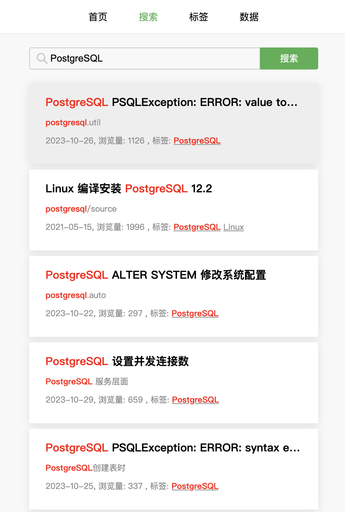
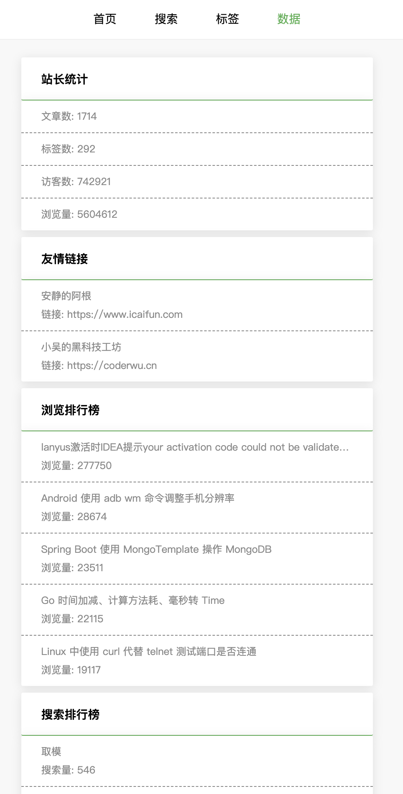
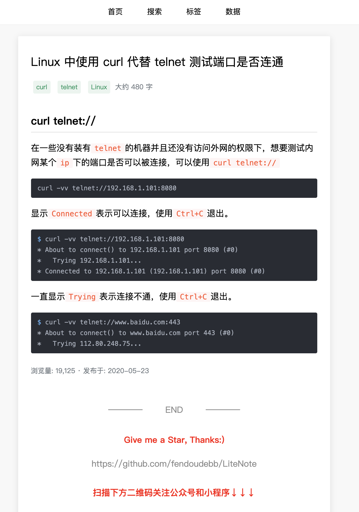
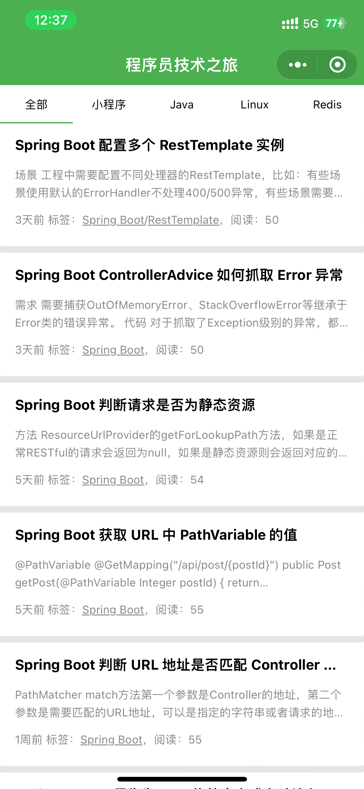
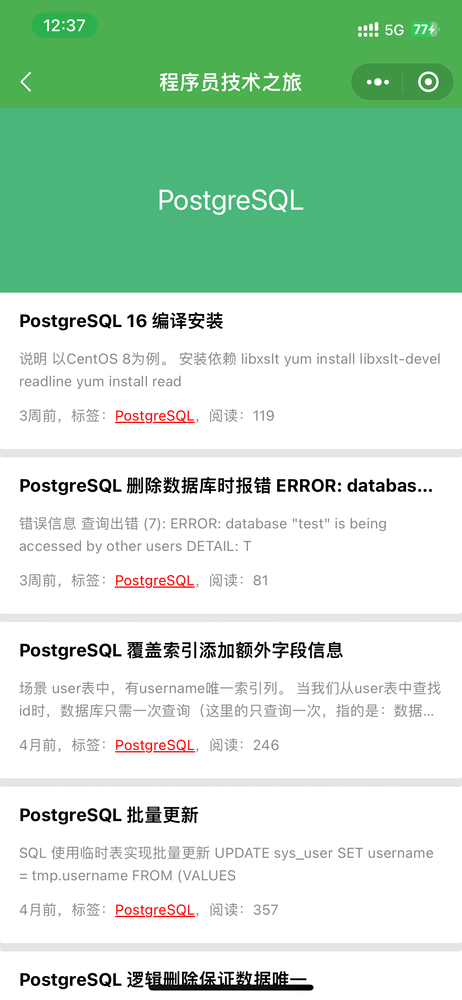
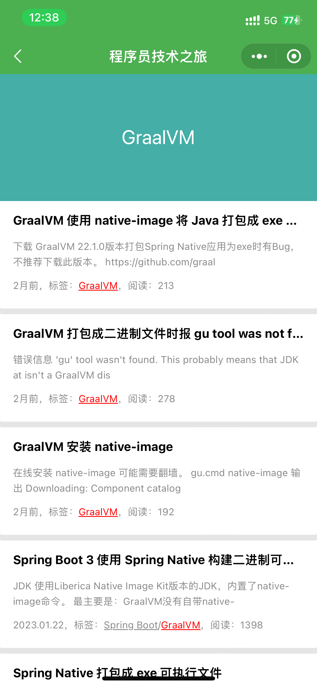

# LiteNote

## 关于

使用`Spring Boot 3`、`GraalVM`、`PostgreSQL`、`Spring Security`、`MyBatis`等构建.

## 框架

[README](./readme/dependency/README.md)

## 链接

[程序员技术之旅：https://www.zhangbj.com](https://www.zhangbj.com)

## 截图

### 网站

### 小程序

